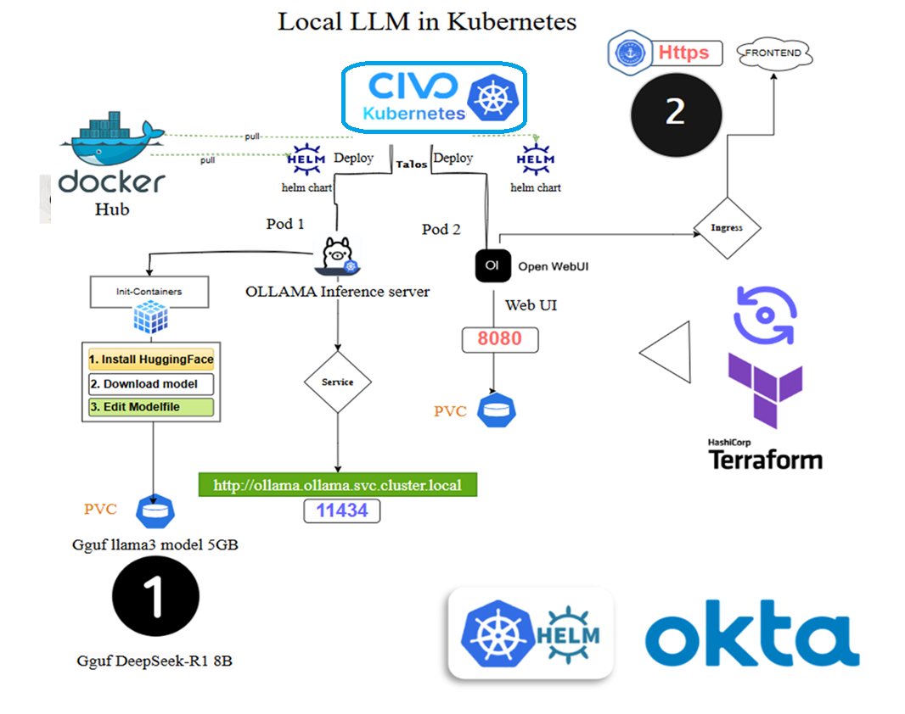

# 🚀 LLM Inference Deployment on Civo Cloud Talos K8s Cluster
<p align="center">
  
</p>

## **Overview**
This repository provides an end-to-end solution for deploying a **local LLM (Large Language Model) inference** setup on a **Civo Cloud Talos Kubernetes Cluster**. 

The deployment includes:

- ✅ **Civo Kubernetes Cluster (Talos)**
- ✅ **Ollama LLM Server**
- ✅ **Open WebUI for model interaction**
- ✅ **Traefik as the Ingress Controller**
- ✅ **Cert-Manager for TLS (Self-Signed Certificate)**
- ✅ **Okta Authentication for Secure Access** (Optional)

---

## **1️⃣ Prerequisites**
Before you begin, ensure you have the following:

- 🛠 [Terraform](https://developer.hashicorp.com/terraform/downloads) (`>=1.5`)
- 🛠 [kubectl](https://kubernetes.io/docs/tasks/tools/) (`>=1.25`)
- 🛠 [Helm](https://helm.sh/docs/intro/install/) (`>=3.10`)
- ☁ **Civo Cloud Account** with an API key
- 🔑 **Okta Developer Account** (if enabling okta authentication)
- 💻 **Local or Cloud-Based Machine** to run the deployment

---

## **2️⃣ Setup Civo Kubernetes Cluster (Talos)**
**Clone the repository**
- cd to the civo sub-directory: 
  ```bash
  $ cd ollama_lab/cloud_deploy/civo/

  ```
**Use an env-vars File**

Export your **TF_VARS** i.e **Civo API Key** in the env-vars file :
```bash
export CIVO_TOKEN="your-civo-api-key"
export TF_VAR_region="NYC1"
#### [OKTA] Optional ##################
export TF_VAR_enable_okta="true"
export TF_VAR_okta_client_id="your-okta-client-id"
export TF_VAR_okta_client_secret="your-okta-client-secret"
export TF_VAR_okta_openid_provider="https://your-okta-domain/oauth2/default"
```
- Load the Variables into Your Shell Before running Terraform, source the env-vars file:
```bash
$ source env-vars
```
  
## **3️⃣ Run Terraform Now that the variables are set, run Terraform:**
```
terraform plan
terraform apply
```
#**Final Output preview**#
```hcl
Apply complete! Resources: 14 added, 0 changed, 0 destroyed.
Outputs:
cluster_installed_applications = tolist([])
kubernetes_cluster_endpoint = "https://212.2.111.111:6443"
kubernetes_cluster_id = "d19dd60f-111-111-1111-529c8a1a5299"
kubernetes_cluster_name = "cloudthrill-cluster"
kubernetes_cluster_ready = true
kubernetes_cluster_status = "ACTIVE"
kubernetes_cluster_version = "talos-v1.5.0"
loadbalancer_dns = {
  "hostname" = "https://random-50a0-4ade-af55-9b253d0b5c8b.lb.civo.com" <---  use this link to log in 
}
master_ip = "212.2.111.111"
network_id = "33161f60-ed86-4f45-903b-94b7959fc991"
```
- Once you click on the loadbalancer dns link you will have the below page:


# 4️⃣ Destroying the Infrastructure
To delete everything:
```
terraform destroy -auto-approve
```
# 5️⃣ Next Steps
- Add GPU Acceleration for LLM inference using nvidia drivers plugin  
- Implement Persistent Storage for Models like S3
- Optimize Autoscaling for Traffic Spikes

----
# **Okta**

 There is a bit of catch 22 problem here. The smartest way to do this is to follow these steps:
 1. Register a Web App in Okta with temporary redirect URIs. Guide: 🔗 Okta OIDC Web App Setup
 2. Get client_id & client_secret, then adjust them in the env-vars accordingly:
 3. Deploy terraform config
 4. After Terraform assigns loadbalancer_dns, update Okta Web App settings:
  - Sign-in redirect URI → `<loadbalancer_dns>/oauth/oidc/callback`
  - Sign-out redirect URI → `<loadbalancer_dns>`

 <p align="center">
  
</p>

- if the first user is logged in from okta it will also be an admin
- if not then you will first need to create an non admin group with default permissions (i.e everyone) and the you can get the okta user added to it


----
# terraform configuraton content

## Requirements

| Name | Version |
|------|---------|
| <a name="requirement_civo"></a> [civo](#requirement\_civo) | 1.1.4 |
| <a name="requirement_helm"></a> [helm](#requirement\_helm) | 2.10.1 |
| <a name="requirement_kubectl"></a> [kubectl](#requirement\_kubectl) | >= 1.19.0 |
| <a name="requirement_kubernetes"></a> [kubernetes](#requirement\_kubernetes) | 2.22.0 |
| <a name="requirement_local"></a> [local](#requirement\_local) | 2.4.0 |

## Providers

| Name | Version |
|------|---------|
| <a name="provider_civo"></a> [civo](#provider\_civo) | 1.1.4 |
| <a name="provider_external"></a> [external](#provider\_external) | 2.3.4 |
| <a name="provider_helm"></a> [helm](#provider\_helm) | 2.10.1 |
| <a name="provider_kubectl"></a> [kubectl](#provider\_kubectl) | 1.19.0 |
| <a name="provider_kubernetes"></a> [kubernetes](#provider\_kubernetes) | 2.22.0 |
| <a name="provider_local"></a> [local](#provider\_local) | 2.4.0 |

## Modules

No modules.

## Resources

| Name | Type |
|------|------|
| [civo_firewall.firewall](https://registry.terraform.io/providers/civo/civo/1.1.4/docs/resources/firewall) | resource |
| [civo_firewall.firewall-ingress](https://registry.terraform.io/providers/civo/civo/1.1.4/docs/resources/firewall) | resource |
| [civo_kubernetes_cluster.cluster](https://registry.terraform.io/providers/civo/civo/1.1.4/docs/resources/kubernetes_cluster) | resource |
| [civo_network.network](https://registry.terraform.io/providers/civo/civo/1.1.4/docs/resources/network) | resource |
| [civo_object_store.template](https://registry.terraform.io/providers/civo/civo/1.1.4/docs/resources/object_store) | resource |
| [helm_release.cert_manager](https://registry.terraform.io/providers/hashicorp/helm/2.10.1/docs/resources/release) | resource |
| [helm_release.ollama](https://registry.terraform.io/providers/hashicorp/helm/2.10.1/docs/resources/release) | resource |
| [helm_release.open_webui](https://registry.terraform.io/providers/hashicorp/helm/2.10.1/docs/resources/release) | resource |
| [helm_release.traefik_ingress](https://registry.terraform.io/providers/hashicorp/helm/2.10.1/docs/resources/release) | resource |
| [kubectl_manifest.openwebui_certificate](https://registry.terraform.io/providers/gavinbunney/kubectl/latest/docs/resources/manifest) | resource |
| [kubectl_manifest.patched_openwebui_ingress](https://registry.terraform.io/providers/gavinbunney/kubectl/latest/docs/resources/manifest) | resource |
| [kubectl_manifest.self_signed_cluster_issuer](https://registry.terraform.io/providers/gavinbunney/kubectl/latest/docs/resources/manifest) | resource |
| [kubernetes_namespace.landing_ns](https://registry.terraform.io/providers/hashicorp/kubernetes/2.22.0/docs/resources/namespace) | resource |
| [kubernetes_namespace.webui_ns](https://registry.terraform.io/providers/hashicorp/kubernetes/2.22.0/docs/resources/namespace) | resource |
| [kubernetes_secret.object_store_access](https://registry.terraform.io/providers/hashicorp/kubernetes/2.22.0/docs/resources/secret) | resource |
| [local_file.cluster-config](https://registry.terraform.io/providers/hashicorp/local/2.4.0/docs/resources/file) | resource |
| [local_file.okta_values](https://registry.terraform.io/providers/hashicorp/local/2.4.0/docs/resources/file) | resource |
| [civo_kubernetes_cluster.cluster](https://registry.terraform.io/providers/civo/civo/1.1.4/docs/data-sources/kubernetes_cluster) | data source |
| [civo_kubernetes_version.latest_talos](https://registry.terraform.io/providers/civo/civo/1.1.4/docs/data-sources/kubernetes_version) | data source |
| [civo_network.existing](https://registry.terraform.io/providers/civo/civo/1.1.4/docs/data-sources/network) | data source |
| [civo_object_store_credential.object_store](https://registry.terraform.io/providers/civo/civo/1.1.4/docs/data-sources/object_store_credential) | data source |
| [civo_size.ai](https://registry.terraform.io/providers/civo/civo/1.1.4/docs/data-sources/size) | data source |
| [external_external.openwebui_ingress](https://registry.terraform.io/providers/hashicorp/external/latest/docs/data-sources/external) | data source |
| [local_file.okta_values_content](https://registry.terraform.io/providers/hashicorp/local/2.4.0/docs/data-sources/file) | data source |

## Inputs

| Name | Description | Type | Default | Required |
|------|-------------|------|---------|:--------:|
| <a name="input_applications"></a> [applications](#input\_applications) | Comma Separated list of Application to be installed | `string` | `"metrics-server,cert-manager,traefik2-nodeport"` | no |
| <a name="input_cluster_name_prefix"></a> [cluster\_name\_prefix](#input\_cluster\_name\_prefix) | Prefix to append to the name of the cluster being created | `string` | `"cloudthrill-"` | no |
| <a name="input_cluster_node_count"></a> [cluster\_node\_count](#input\_cluster\_node\_count) | Number of nodes in the default pool | `number` | `2` | no |
| <a name="input_cluster_node_size"></a> [cluster\_node\_size](#input\_cluster\_node\_size) | The size of the nodes to provision. Run `civo size list` for all options | `string` | `""` | no |
| <a name="input_cluster_type"></a> [cluster\_type](#input\_cluster\_type) | The type of Kubernetes cluster to create | `string` | `"talos"` | no |
| <a name="input_cluster_web_access"></a> [cluster\_web\_access](#input\_cluster\_web\_access) | List of Subnets allowed to access port 80 via the Load Balancer | `list(any)` | <pre>[<br/>  "0.0.0.0/0"<br/>]</pre> | no |
| <a name="input_cluster_websecure_access"></a> [cluster\_websecure\_access](#input\_cluster\_websecure\_access) | List of Subnets allowed to access port 443 via the Load Balancer | `list(any)` | <pre>[<br/>  "0.0.0.0/0"<br/>]</pre> | no |
| <a name="input_cni"></a> [cni](#input\_cni) | The cni for the k3s to install | `string` | `"flannel"` | no |
| <a name="input_enable_okta"></a> [enable\_okta](#input\_enable\_okta) | Enable Okta authentication | `bool` | `false` | no |
| <a name="input_kubernetes_api_access"></a> [kubernetes\_api\_access](#input\_kubernetes\_api\_access) | List of Subnets allowed to access the Kube API | `list(any)` | <pre>[<br/>  "0.0.0.0/0"<br/>]</pre> | no |
| <a name="input_kubernetes_version"></a> [kubernetes\_version](#input\_kubernetes\_version) | The version of Kubernetes to use | `string` | `"talos-v1.5.0"` | no |
| <a name="input_label"></a> [label](#input\_label) | Node pool label. If not provided, a default label will be generated. | `string` | `"llama-pool"` | no |
| <a name="input_network_cidr"></a> [network\_cidr](#input\_network\_cidr) | The CIDR block for the network | `string` | `"10.20.0.0/16"` | no |
| <a name="input_network_name"></a> [network\_name](#input\_network\_name) | The name of the network | `string` | `"default"` | no |
| <a name="input_node_pool_labels"></a> [node\_pool\_labels](#input\_node\_pool\_labels) | Additional labels for the node pool. | `map(string)` | `{}` | no |
| <a name="input_object_store_enabled"></a> [object\_store\_enabled](#input\_object\_store\_enabled) | Should an object store be configured | `bool` | `false` | no |
| <a name="input_object_store_prefix"></a> [object\_store\_prefix](#input\_object\_store\_prefix) | Prefix to append to the name of the object store being created | `string` | `"tf-template-"` | no |
| <a name="input_object_store_size"></a> [object\_store\_size](#input\_object\_store\_size) | Size of the Object Store to create (multiples of 500) | `number` | `500` | no |
| <a name="input_okta_client_id"></a> [okta\_client\_id](#input\_okta\_client\_id) | The Okta Client ID for OpenID integration | `string` | `null` | no |
| <a name="input_okta_client_secret"></a> [okta\_client\_secret](#input\_okta\_client\_secret) | The Okta Client Secret for OpenID integration | `string` | `null` | no |
| <a name="input_okta_openid_provider"></a> [okta\_openid\_provider](#input\_okta\_openid\_provider) | The Okta OpenID Provider URL | `string` | `null` | no |
| <a name="input_region"></a> [region](#input\_region) | The region to provision the cluster against | `string` | `"NYC1"` | no |
| <a name="input_tags"></a> [tags](#input\_tags) | Tags | `string` | `"terraform"` | no |
| <a name="input_taints"></a> [taints](#input\_taints) | A list of taints to apply to the nodes in the node pool. | `list` | <pre>[<br/>  {<br/>    "effect": "NoSchedule",<br/>    "key": "ollama-workload",<br/>    "value": "frontend"<br/>  }<br/>]</pre> | no |

## Outputs

| Name | Description |
|------|-------------|
| <a name="output_cluster_installed_applications"></a> [cluster\_installed\_applications](#output\_cluster\_installed\_applications) | n/a |
| <a name="output_kubernetes_cluster_endpoint"></a> [kubernetes\_cluster\_endpoint](#output\_kubernetes\_cluster\_endpoint) | n/a |
| <a name="output_kubernetes_cluster_id"></a> [kubernetes\_cluster\_id](#output\_kubernetes\_cluster\_id) | n/a |
| <a name="output_kubernetes_cluster_name"></a> [kubernetes\_cluster\_name](#output\_kubernetes\_cluster\_name) | n/a |
| <a name="output_kubernetes_cluster_ready"></a> [kubernetes\_cluster\_ready](#output\_kubernetes\_cluster\_ready) | n/a |
| <a name="output_kubernetes_cluster_status"></a> [kubernetes\_cluster\_status](#output\_kubernetes\_cluster\_status) | n/a |
| <a name="output_kubernetes_cluster_version"></a> [kubernetes\_cluster\_version](#output\_kubernetes\_cluster\_version) | n/a |
| <a name="output_loadbalancer_dns"></a> [loadbalancer\_dns](#output\_loadbalancer\_dns) | n/a |
| <a name="output_master_ip"></a> [master\_ip](#output\_master\_ip) | n/a |
| <a name="output_network_id"></a> [network\_id](#output\_network\_id) | The ID of the Civo Network. |
